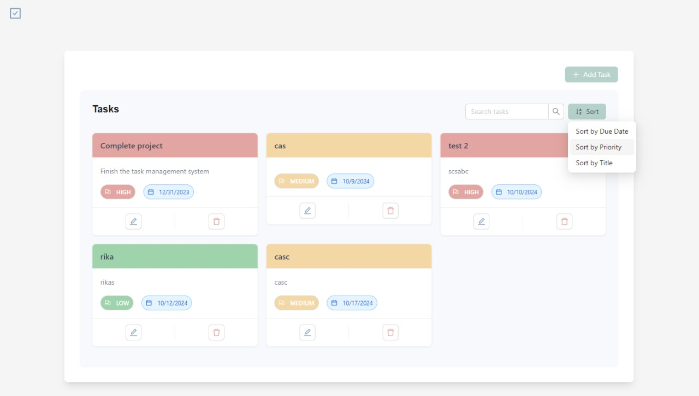

# Task Management System

## Overview

Task Management System is a modern, responsive web application designed to help users organize, track, and manage their tasks efficiently. Built with React and Node.js, it offers a seamless experience for creating, updating, and monitoring tasks across various devices.



## Features

- **User-friendly Interface**: Clean and intuitive design for easy task management.
- **Task Creation and Editing**: Quickly add new tasks or edit existing ones.
- **Priority Levels**: Assign low, medium, or high priority to tasks.
- **Due Dates**: Set and track due dates for each task.
- **Sorting and Filtering**: Easily sort tasks by due date, priority, or title.
- **Search Functionality**: Quickly find tasks using the search feature.
- **Responsive Design**: Seamless experience across desktop, tablet, and mobile devices.

## Technology Stack

- **Frontend**:

  - React
  - TypeScript
  - Ant Design
  - Tailwind CSS
  - React Query

- **Backend**:

  - Node.js
  - Express.js
  - PostgreSQL
  - Knex.js

- **DevOps**:
  - Docker
  - Docker Compose

## Getting Started

### Prerequisites

- Node.js (v14 or later)
- npm or yarn
- Docker and Docker Compose (for containerized deployment)

### Installation

1. Clone the repository:

   ```
   git clone https://github.com/yourusername/task-management-system.git
   cd task-management-system
   ```

2. Install dependencies:

   ```
   cd client && npm install
   cd ../server && npm install
   ```

3. Set up environment variables:

   - Create a `.env` file in the `server` directory
   - Add necessary environment variables (e.g., `DATABASE_URL`, `PORT`)

4. Start the development servers:
   - For the client: `cd client && npm run dev`
   - For the server: `cd server && npm run dev`

### Docker Deployment

To run the application using Docker:

1. Ensure Docker and Docker Compose are installed on your system.
2. From the project root, run:
   ```
   docker-compose up --build
   ```
3. Access the application at `http://localhost:80`

## Usage

1. **Adding a Task**: Click the "Add Task" button and fill in the task details.
2. **Editing a Task**: Click the edit icon on a task card to modify its details.
3. **Deleting a Task**: Use the delete icon on a task card to remove it.
4. **Searching Tasks**: Use the search bar to filter tasks by title or description.
5. **Sorting Tasks**: Click the "Sort" button to arrange tasks by due date, priority, or title.

## Contributing

We welcome contributions to the Task Management System! Please follow these steps to contribute:

1. Fork the repository
2. Create a new branch: `git checkout -b feature-branch-name`
3. Make your changes and commit them: `git commit -m 'Add some feature'`
4. Push to the branch: `git push origin feature-branch-name`
5. Submit a pull request

## License

This project is licensed under the MIT License - see the [LICENSE.md](LICENSE.md) file for details.

## Acknowledgments

- Ant Design for the UI components
- React Query for efficient data fetching
- All contributors who have helped shape this project

## Contact

For any queries or suggestions, please open an issue on this repository or contact the maintainers directly.

---

Happy Task Managing!
